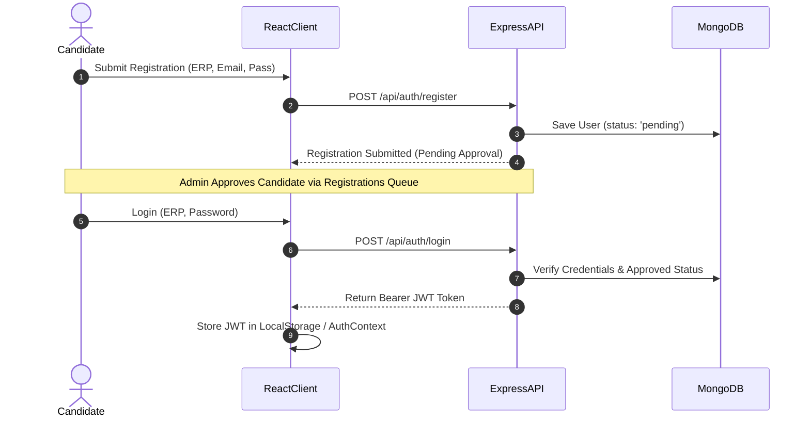

# System Architecture Document

## 1. Executive Summary

The **MITRA Employability Portal** is designed using a modern full-stack MERN (MongoDB, Express.js, React.js, Node.js) architecture integrated with real-time AI computer vision models and third-party compiler execution sandboxes. This document presents the comprehensive software architecture, security layers, component designs, and deployment models.

---

## 2. Overall System Architecture Diagram

```mermaid
graph TD
    subgraph Client Layer [Frontend React Client]
        UI[React 18 SPA]
        Proctor[Face-api.js Proctor Module]
        State[React Context / Hooks]
    end

    subgraph API Gateway / Middleware [Express Gateway]
        AuthGuard[JWT Auth Middleware]
        AdminGuard[Admin Privilege Check]
        UploadGuard[Multer Storage]
    end

    subgraph Service & Controller Layer [Node.js Backend]
        AuthCtrl[Auth & Queue Controller]
        TestCtrl[Test Engine Controller]
        ProcCtrl[Proctor Violation Service]
        AiCtrl[HuggingFace AI Service]
        CompCtrl[Piston Code Compiler Service]
        PdfCtrl[PDF Parser Service]
    end

    subgraph External Infrastructure
        HF[HuggingFace AI Model API]
        Piston[Piston Code Execution Sandbox]
        SMTP[Nodemailer Email Service]
    end

    subgraph Persistence Layer
        DB[(MongoDB Database)]
    end

    UI -->|HTTPS / REST API| AuthGuard
    Proctor -->|Violation Events| ProcCtrl
    AuthGuard --> AdminGuard
    AdminGuard --> Service Layer
    AiCtrl -->|HTTPS| HF
    CompCtrl -->|HTTPS| Piston
    PdfCtrl -->|Parse Buffer| UploadGuard
    Service Layer --> DB
    AuthCtrl -->|SMTP| SMTP
```

---

## 3. Frontend Architecture (React + Vite)

The frontend is structured as a Single Page Application (SPA) utilizing **React 18**, **Vite**, **React Router v6**, and **Tailwind CSS**.

### Key Architectural Modules:
- **Routing & Guards (`App.jsx`, `ProtectedRoute.jsx`)**: Enforces authentication tokens and role authorization (`admin` vs `student`).
- **Webcam Proctor Engine (`hooks/useProctoring.js`, `face-api.js`)**: Runs client-side tensor models to monitor candidate presence, posture, tab focus changes, and multi-face occurrences during live assessments.
- **Timed Assessment Controller (`pages/AttemptPage.jsx`)**: Synchronizes server-side countdown timers, manages answer buffers, autosaves state, and handles execution requests.

---

## 4. Backend Architecture (Node.js + Express)

The backend follows an enterprise **Model-View-Controller (MVC)** architectural pattern with decoupled services for third-party integrations.

```
server/
├── config/        # Database Connection Configuration
├── controllers/   # Request Handlers & Business Logic
├── middleware/    # Auth Guards, Permission Checks, Multer File Handlers
├── models/        # Mongoose Data Schema Definitions
├── routes/        # REST Endpoints Mapping
└── services/      # External Integrations (AI, Compiler Sandbox, Email)
```

---

## 5. Database Architecture (MongoDB + Mongoose)

Document-oriented MongoDB structure optimized for fast read operations on tests and question banks, with index-backed aggregation queries for leaderboards.

### Core Entities:
- **Users**: Admin & Candidate profiles, ERP numbers, pending approval states, hashed passwords.
- **Tests**: Test metadata, durations, passing rules, attached question lists, activation status.
- **Questions**: MCQ options, coding language choices, sample & hidden test case pairs.
- **Attempts**: Candidate answer sheets, score metrics, proctoring violation logs, timestamp logs.
- **Proctoring**: Granular violation entries linked to user attempt IDs.

---

## 6. Authentication & Authorization Flow



---

## 7. AI Module Architecture

The AI module consists of two distinct components:
1. **Computer Vision Proctoring (Client-Side)**: Uses `face-api.js` (SSDMobileNetv1 / TinyFaceDetector) running on client Web Workers to perform face landmark detection without sending heavy video streams to the server.
2. **AI Question Generation (Server-Side)**: Communicates with HuggingFace Inference API using prompt templates to generate formatted MCQ and coding questions dynamically based on domain requirements.

---

## 8. Code Compiler Module Architecture

Candidate code submitted during assessments or topic practice is evaluated in an isolated execution sandbox.

- **Sandbox API**: Integrates with Piston API / OnlineCompiler API.
- **Languages Supported**: Python, C++, Java, JavaScript.
- **Execution Flow**: Candidate Code + Test Case Input → Sandbox Endpoint → Output & Execution Time Returned → Assertion Match against Expected Output.

---

## 9. Future Payment Module Architecture

Planned integration for institutional subscription billing and certification fee collection:
- **Gateway**: Razorpay / Stripe Webhooks.
- **Flow**: Order Creation → Payment Gateway Modal → Webhook Listener → Instant User Subscription Status Update.

---

## 10. Deployment Architecture

- **Containerization**: Docker & Docker Compose setup separating Frontend (Vite build served via Nginx/Node), Backend (Express API), and MongoDB Container.
- **Cloud Hosting**: Compatible with AWS EC2 / Render / Vercel for Frontend and MongoDB Atlas for Database storage.
