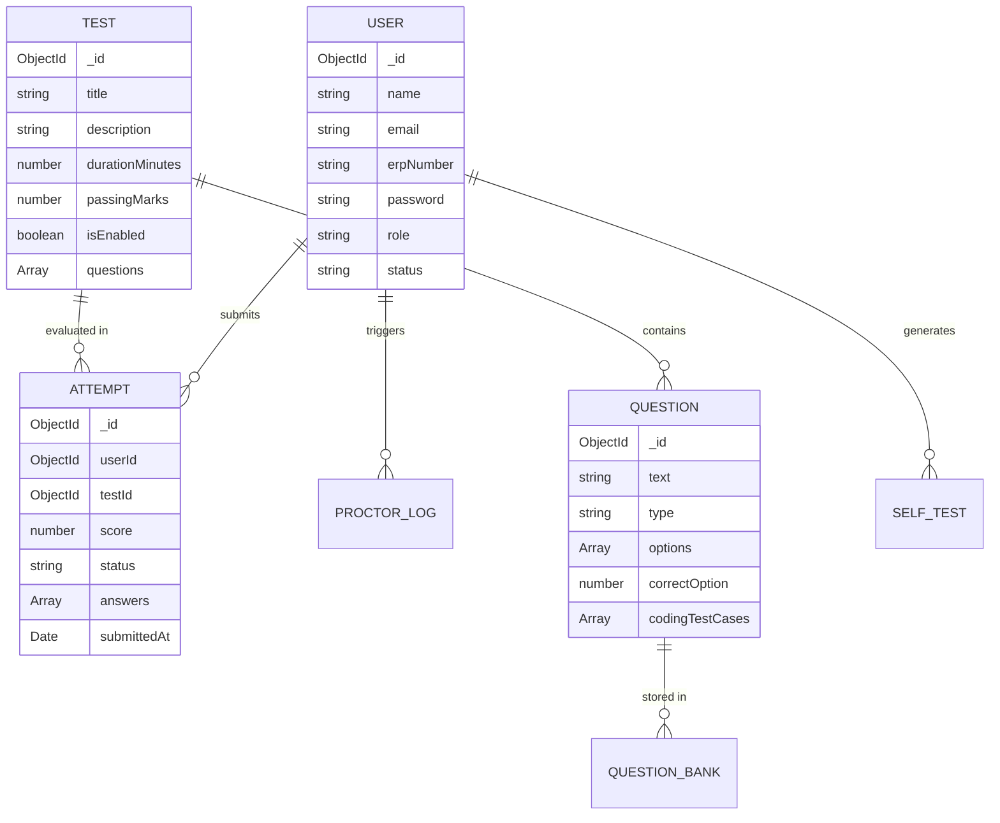

# Database Schema & Entity Relationship Design

Database: **MongoDB**  
ORM: **Mongoose Schema Engine**

---

## 1. Entity Relationship Overview

---

## 2. Collection Schema Specifications

### `users` Collection
Stores candidate accounts and administrative user credentials.
- **Indexes**: `email` (Unique), `erpNumber` (Sparse Unique), `status` + `role`.

### `tests` Collection
Stores placement assessment containers and attached question references.
- **Indexes**: `isEnabled`, `createdAt`.

### `questions` Collection
Stores MCQ and Coding question definitions with test cases.
- **Indexes**: `category`, `difficulty`, `type`.

### `attempts` Collection
Stores completed and ongoing candidate test attempts.
- **Indexes**: `userId` + `testId` (Compound Index), `score` (Descending for Leaderboards).

### `proctorlogs` Collection
Records candidate proctoring violations during live attempts.
- **Indexes**: `attemptId`, `userId`.

---

## 3. Future Collections (Phase 3 - 6)
- **`payments`**: Transaction IDs, amounts, gateway signatures, status.
- **`resumereviews`**: ATS scores, extracted keywords, recommendations.
- **`mockinterviews`**: Audio/video transcripts, speech metrics, score cards.
