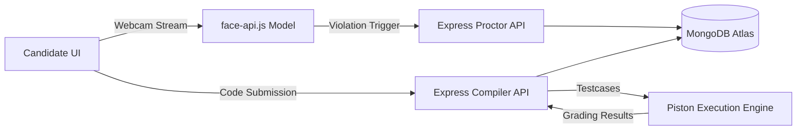
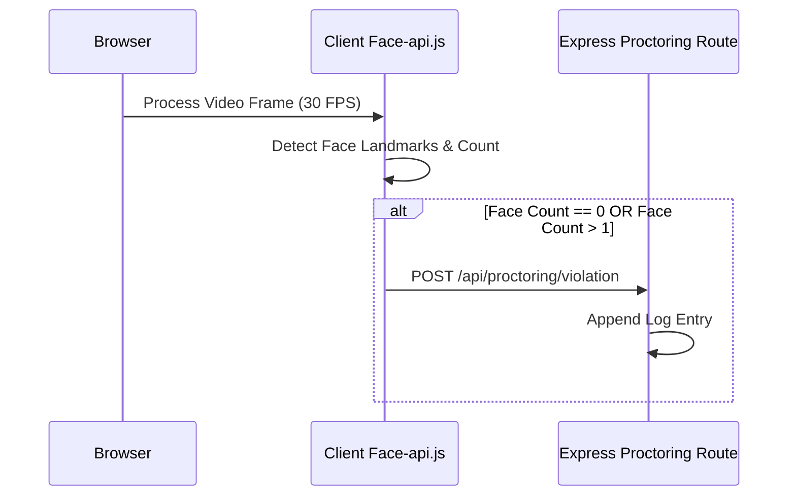

# Research Paper Architecture Diagrams

## Figure 1: High-Level Platform Flow

```mermaid
flowchart LR
    A[Candidate UI] -->|Webcam Stream| B[face-api.js Model]
    B -->|Violation Trigger| C[Express Proctor API]
    A -->|Code Submission| D[Express Compiler API]
    D -->|Testcases| E[Piston Execution Engine]
    E -->|Grading Results| D
    C --> F[(MongoDB Atlas)]
    D --> F
```

## Figure 2: Proctoring AI Sequence Diagram

```mermaid
sequenceDiagram
    participant Browser
    participant VisionModel as Client Face-api.js
    participant Server as Express Proctoring Route
    
    Browser->>VisionModel: Process Video Frame (30 FPS)
    VisionModel->>VisionModel: Detect Face Landmarks & Count
    alt Face Count == 0 OR Face Count > 1
        VisionModel->>Server: POST /api/proctoring/violation
        Server->>Server: Append Log Entry
    end
```
