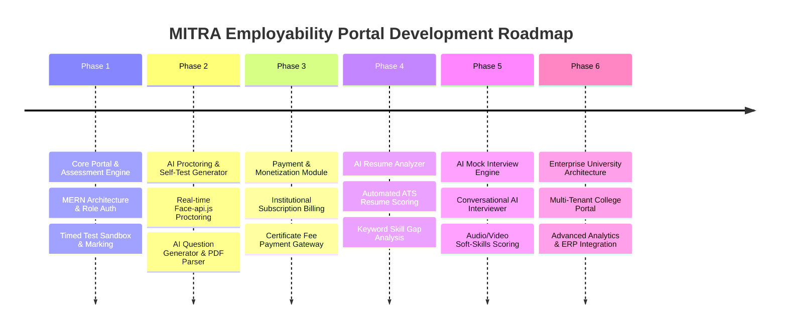

# Product Development Roadmap

---

## Phase Details

### Phase 1: Core Portal (Completed)
- MERN Stack Architecture with JWT Role-Based Auth.
- Admin Student Registrations Approval Queue.
- Timed Test Engine with MCQ & Coding Question Support.
- Piston / OnlineCompiler Sandbox Execution.

### Phase 2: AI Self-Test & Proctoring (Completed)
- Client-side `face-api.js` face detection & tab switch proctoring logs.
- HuggingFace AI Question Generation.
- PDF Placement Paper Parser.
- Psychometric Assessment & Study Material Hub.

### Phase 3: Payment & Certificate Module (Planned)
- Razorpay / Stripe integration for institutional licensing.
- Automated PDF Certificate generation on assessment completion.

### Phase 4: AI Resume Analyzer (Planned)
- Upload candidate resumes (PDF/DOCX).
- Automated ATS scoring against job description criteria.
- Skill gap analysis and recommended study modules.

### Phase 5: AI Mock Interview Evaluator (Planned)
- Real-time conversational AI interviewer agent.
- Audio speech-to-text analysis and soft-skills scoring.

### Phase 6: Enterprise Features (Planned)
- Multi-tenant architecture for multi-campus university deployments.
- Direct ERP integration sync for candidate records.
